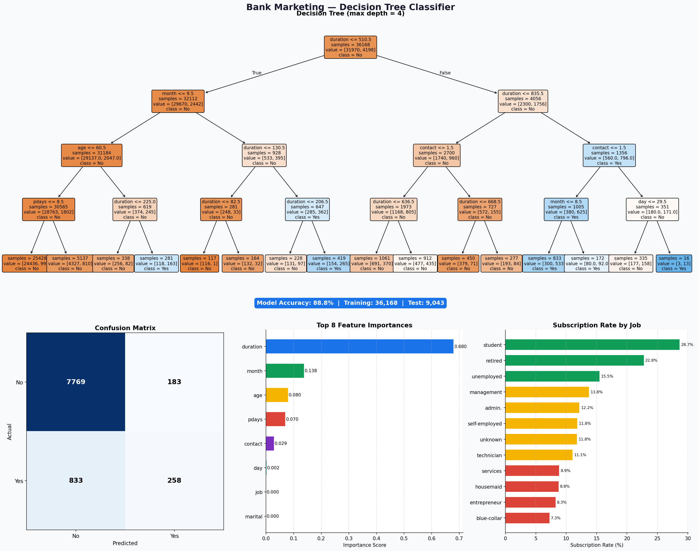

# PRODIGY_DS_03 — Decision Tree Classifier

## Task Overview
Build a decision tree classifier to predict whether a customer will 
purchase a product or service based on their demographic and behavioral 
data.

**Internship:** Prodigy InfoTech — Data Science Track

## Dataset
- **Source:** UCI Machine Learning Repository — Bank Marketing
- **File:** bank-full.csv
- **Size:** 45,211 customers, 16 features
- **Target:** y — did the customer subscribe? (yes/no)

## Features Used
| Feature | Description |
|---------|-------------|
| age | Customer age |
| job | Type of job |
| marital | Marital status |
| education | Education level |
| balance | Account balance |
| duration | Last call duration (seconds) |
| campaign | Number of contacts this campaign |
| pdays | Days since last contact |
| previous | Previous campaign contacts |
| poutcome | Previous campaign outcome |

## Model
- **Algorithm:** Decision Tree Classifier
- **Max Depth:** 4
- **Train/Test Split:** 80% / 20%
- **Accuracy:** 88.76%

## Key Findings
- Call duration was the most important feature (68% importance)
- Month and age were the next most significant factors
- Students and retired customers had the highest subscription rates
- Only 11.7% of customers subscribed — imbalanced dataset

## Visualizations


## Tools Used
- Python 3
- Pandas
- Scikit-learn
- Matplotlib
- NumPy

## How to Run
```bash
pip install pandas matplotlib numpy scikit-learn
python task03_decision_tree.py
```
